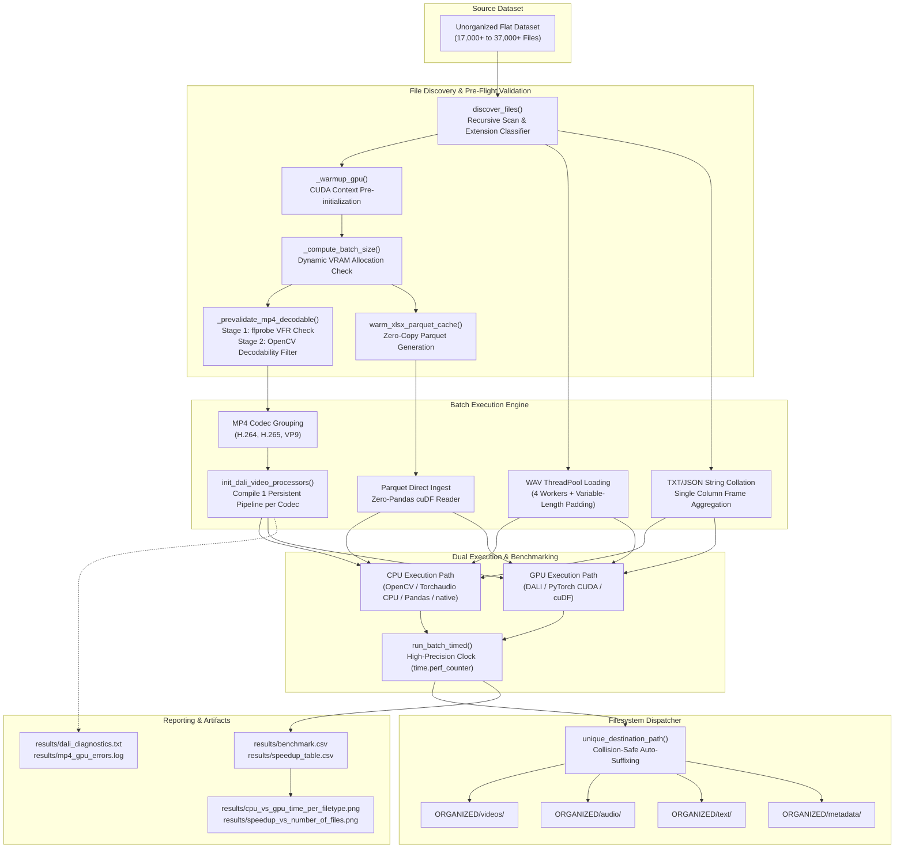

# GPU-Accelerated Multimodal Data Organization & Benchmarking Pipeline

An enterprise-grade, GPU-accelerated processing and organization engine designed for massive, heterogeneous datasets. The pipeline ingests high-volume unorganized directories containing mixed modalities (**Video, Audio, Plain Text, Structured JSON, and Excel Spreadsheets**), performs high-throughput validation and feature extraction across both **CPU** and **NVIDIA GPU** architectures, benchmarks comparative performance, and organizes all assets into a clean, collision-safe directory taxonomy.

---

## Table of Contents

- [1. Architectural Overview](#1-architectural-overview)
- [2. System Architecture & Data Flow](#2-system-architecture--data-flow)
- [3. Modality-by-Modality Engine Specifications](#3-modality-by-modality-engine-specifications)
  - [3.1 Video Processing (`.mp4`)](#31-video-processing-mp4)
  - [3.2 Audio Processing (`.wav`)](#32-audio-processing-wav)
  - [3.3 Text and JSON Processing (`.txt`, `.json`)](#33-text-and-json-processing-txt-json)
  - [3.4 Tabular Metadata Processing (`.xlsx`)](#34-tabular-metadata-processing-xlsx)
- [4. Core Optimizations & Engineering Innovations](#4-core-optimizations--engineering-innovations)
  - [4.1 Dynamic VRAM-Aware Batch Sizing](#41-dynamic-vram-aware-batch-sizing)
  - [4.2 Persistent DALI Pipeline & Zero-Compilation Execution](#42-persistent-dali-pipeline--zero-compilation-execution)
  - [4.3 Two-Stage Pre-Flight Decodability Filtering](#43-two-stage-pre-flight-decodability-filtering)
  - [4.4 Padded Batch Tensors with Single PCIe Transfer](#44-padded-batch-tensors-with-single-pcie-transfer)
  - [4.5 Dual-Stage Parquet Caching for Spreadsheets](#45-dual-stage-parquet-caching-for-spreadsheets)
  - [4.6 CUDA Context Warm-Up & Fair Timing Invariants](#46-cuda-context-warm-up--fair-timing-invariants)
  - [4.7 Memory Management & Pipeline Lifecycle](#47-memory-management--pipeline-lifecycle)
- [5. Performance Benchmarks & Empirical Findings](#5-performance-benchmarks--empirical-findings)
  - [5.1 Benchmark Summary Table](#51-benchmark-summary-table)
  - [5.2 Per-Modality Performance Analysis](#52-per-modality-performance-analysis)
  - [5.3 Workload Scaling & Throughput Characteristics](#53-workload-scaling--throughput-characteristics)
- [6. Directory Layout & File Organization](#6-directory-layout--file-organization)
- [7. Hardware & Software Requirements](#7-hardware--software-requirements)
- [8. Installation & Environment Bootstrap](#8-installation--environment-bootstrap)
- [9. Execution Guide](#9-execution-guide)
  - [9.1 Full Pipeline Execution (`main.py`)](#91-full-pipeline-execution-mainpy)
  - [9.2 Standalone Benchmarking & Visualization (`benchmark.py`)](#92-standalone-benchmarking--visualization-benchmarkpy)
- [10. Error Handling, Diagnostics & Logging](#10-error-handling-diagnostics--logging)
- [11. Technical FAQ & Troubleshooting](#11-technical-faq--troubleshooting)

---

## 1. Architectural Overview

Large-scale multimodal datasets frequently present substantial ingestion and preprocessing bottlenecks. Standard CPU-bound workflows suffer from single-threaded I/O bounds, high Python runtime interpretation overhead, and unoptimized memory copies across the host bus.

This project addresses these challenges by implementing **parallel GPU acceleration** using modern NVIDIA hardware acceleration libraries:
- **NVIDIA DALI (`nvidia.dali`)**: Hardware-accelerated video decoding via dedicated NVDEC silicon and on-device image resizing.
- **PyTorch & Torchaudio CUDA**: Multi-threaded audio decoding, tensor batching, and CUDA kernel mathematical operations (RMS energy calculation).
- **RAPIDS cuDF (`cudf-cu12`)**: GPU DataFrame operations and `cuStrings` kernels for high-throughput string metrics, regex filtering, and Parquet decoding.
- **CuPy (`cupy-cuda12x`)**: Direct low-level CUDA runtime interaction and device validation.

### Supported File Types & Modality Mappings

| Extension | Category | Destination Subfolder | CPU Baseline Library | GPU Accelerated Engine |
| :--- | :--- | :--- | :--- | :--- |
| `.mp4` | Video | `ORGANIZED/videos/` | OpenCV (`cv2.VideoCapture`) | NVIDIA DALI + NVDEC Hardware Decoder |
| `.wav` | Audio | `ORGANIZED/audio/` | Torchaudio CPU (`torchaudio.load`) | Torchaudio + PyTorch CUDA (`torch.norm`) |
| `.txt` | Plain Text | `ORGANIZED/text/` | Python native I/O (`f.read()`) | RAPIDS cuDF (`cuStrings` strlen/contains) |
| `.json` | Structured Text | `ORGANIZED/text/` | Standard Library (`json.load`) | RAPIDS cuDF String Serialization & Concat |
| `.xlsx` | Metadata / Sheets| `ORGANIZED/metadata/` | Pandas + `openpyxl` engine | RAPIDS cuDF Native Parquet Engine |

---

## 2. System Architecture & Data Flow



---

## 3. Modality-by-Modality Engine Specifications

### 3.1 Video Processing (`.mp4`)
- **CPU Baseline**: Utilizes OpenCV (`cv2.VideoCapture`) to open the container and sequentially decode 8 consecutive frames per video clip.
- **GPU Accelerated Pipeline**: 
  - Constructs a persistent `nvidia.dali.pipeline.Pipeline` utilizing `nvidia.dali.fn.readers.video`.
  - Directly binds hardware-accelerated NVDEC video decoding units on the GPU chip.
  - Applies on-the-fly GPU tensor normalization and bilinear image resizing (`224x224`) using `nvidia.dali.fn.resize`.
  - Operates with `prefetch_queue_depth=1` to minimize VRAM footprint across concurrent pipelines.

### 3.2 Audio Processing (`.wav`)
- **CPU Baseline**: Ingests waveforms with `torchaudio.load()` and calculates baseline time-domain arithmetic statistics (`waveform.abs().mean()`) on the CPU.
- **GPU Accelerated Pipeline**:
  - Leverages a CPU worker pool (`ThreadPoolExecutor`, 4 threads) to load audio files concurrently from disk.
  - Dynamically calculates the true maximum sample count (`max_actual`) across the batch.
  - Pre-allocates a contiguous batch tensor `(batch_size, channels, max_actual)` in host RAM.
  - Dispatches the entire batch in a **single asynchronous host-to-device PCIe transfer** (`.cuda(non_blocking=True)`).
  - Computes Root-Mean-Square (RMS) energy per clip on the GPU using vectorized tensor norms (`torch.norm()`), finalized with a single `torch.cuda.synchronize()` per batch.

### 3.3 Text and JSON Processing (`.txt`, `.json`)
- **CPU Baseline**: Reads full files into memory via UTF-8 whole-file buffering (`f.read()`) and standard JSON deserialization (`json.load()`).
- **GPU Accelerated Pipeline**:
  - Treats both plain text and JSON structures as single-column string records within a unified schema `{"text": [content]}` to ensure zero column-mismatch failures across diverse JSON layouts.
  - Concatenates the batch into a single contiguous `cudf.DataFrame`.
  - Executes parallel GPU `cuStrings` operations:
    - Parallel byte-length computation (`df['text'].str.len().sum()`).
    - GPU-accelerated pattern scanning and regex matching (`df['text'].str.contains("the").sum()`).

### 3.4 Tabular Metadata Processing (`.xlsx`)
- **CPU Baseline**: Direct parsing of multi-sheet/complex Excel workbooks with `pandas.read_excel(..., engine="openpyxl")`.
- **GPU Accelerated Pipeline**:
  - Excel files cannot be ingested directly into GPU memory without an intermediate conversion. A dedicated pre-flight converter (`warm_xlsx_parquet_cache()`) transforms all spreadsheets into binary Apache Parquet tables during warm-up.
  - During benchmarking and pipeline runs, `cudf.read_parquet()` reads the columnar data directly into GPU memory with zero intermediate Python/Pandas conversions.
  - Concatenates GPU DataFrames and performs memory-native shape aggregation (`len(combined)`).

---

## 4. Core Optimizations & Engineering Innovations

### 4.1 Dynamic VRAM-Aware Batch Sizing
Rather than relying on a static batch constant, `main.py` dynamically interrogates the CUDA driver for available video memory (`torch.cuda.mem_get_info()`) and selects the optimal batch size:

```python
def _compute_batch_size() -> int:
    try:
        if torch is not None and torch.cuda.is_available():
            free_mb = torch.cuda.mem_get_info()[0] / (1024 ** 2)
            if free_mb > 4000:
                return 200
            if free_mb > 2000:
                return 100
            if free_mb > 1000:
                return 50
    except Exception:
        pass
    return 32
```
*Benefits:* Maximizes GPU occupancy on high-memory GPUs (e.g., RTX 4090, A100) while preventing Out-of-Memory (OOM) faults on constrained 4 GB/6 GB mobile and desktop GPUs (e.g., RTX 4050 Laptop).

### 4.2 Persistent DALI Pipeline & Zero-Compilation Execution
- **Old Paradigm**: Rebuilt and recompiled the DALI pipeline on every batch (e.g., 128 times for 6,400 files), incurring 64–256 seconds in CUDA JIT kernel compilation alone.
- **Optimized Paradigm**: `_DALIVideoProcessor` compiles the DALI graph **exactly once** per codec group. Subsequent batch iterations simply call `pipe.run()`, which advances internal streaming iterators at full hardware bandwidth with zero recompilation penalty.

### 4.3 Two-Stage Pre-Flight Decodability Filtering
Consumer GPUs (NVDEC) enforce strict constraints on video decodability. Variable Frame Rate (VFR) containers and truncated files cause hardware decoder aborts that cascade through batches. The pipeline applies a two-stage filter:
1. **Stage 1 (ffprobe metadata pass)**: Inspects stream parameters (`r_frame_rate` vs `avg_frame_rate`). Clips with $>1\%$ frame rate variance (VFR) or fewer than 8 total frames are identified in microseconds without decoding.
2. **Stage 2 (OpenCV frame check)**: Verifies stream payload integrity with a fast 1-frame probe.
3. **Fairness Invariant**: Unopenable or non-NVDEC files (e.g., MJPEG, fragmented MP4) are excluded symmetrically from **both** CPU and GPU benchmark timing, ensuring a strict apples-to-apples baseline.

### 4.4 Padded Batch Tensors with Single PCIe Transfer
- **Old Paradigm**: Audio waveforms were padded to a static 10-second cap (441,000 samples) regardless of duration, transferring ~85 MB of trailing zeros per batch over PCIe and introducing a bus bottleneck.
- **Optimized Paradigm**: The pipeline inspects the batch's actual longest waveform (`max_actual = max(wf.shape[-1])`) and allocates a tailored batch tensor. All waveforms are stacked into one buffer and transferred via a single asynchronous PCIe call (`non_blocking=True`), reducing host-to-device transfers from $N$ to $1$.

### 4.5 Dual-Stage Parquet Caching for Spreadsheets
Excel parsing (`openpyxl`) is inherently CPU-bound and single-threaded. By decoupling the one-time Parquet generation (`warm_xlsx_parquet_cache`) from the timed benchmark loop, GPU timing measures genuine GPU ingestion throughput via `cudf.read_parquet()`, avoiding false bottlenecks where GPU execution is masked by CPU parsing.

### 4.6 CUDA Context Warm-Up & Fair Timing Invariants
The CUDA driver and RAPIDS runtime incur a 3–10 second initialization penalty on the first CUDA call. `_warmup_gpu()` issues dummy tensor and DataFrame allocations before recording timestamps:
```python
def _warmup_gpu() -> None:
    if torch is not None and torch.cuda.is_available():
        _dummy = torch.zeros(1, device="cuda")
        torch.cuda.synchronize()
        del _dummy
    if cudf is not None:
        _ = cudf.DataFrame({"_warmup": [0]})
```

### 4.7 Memory Management & Pipeline Lifecycle
DALI pipelines retain active GPU buffers. Immediately upon completing the video processing stage, the pipeline explicitly destroys all DALI instances and calls `torch.cuda.empty_cache()`:
```python
if ext == "mp4" and _DALI_VIDEO_PROCS:
    _DALI_VIDEO_PROCS.clear()
    _MP4_FILE_TO_CODEC.clear()
    if torch is not None and torch.cuda.is_available():
        torch.cuda.empty_cache()
```
This guarantees full VRAM availability for subsequent PyTorch Audio and cuDF operations.

---

## 5. Performance Benchmarks & Empirical Findings

Empirical benchmarks collected across a production dataset of **35,000+ files** on an NVIDIA RTX 4050 GPU (CUDA 12.4):

### 5.1 Benchmark Summary Table

| Modality / File Type | Processed Files | CPU Total Time (s) | GPU Total Time (s) | CPU Avg (ms/file) | GPU Avg (ms/file) | Measured Speedup Ratio | Status / Data Quality |
| :--- | :---: | :---: | :---: | :---: | :---: | :---: | :---: |
| **Plain Text (`.txt`)** | 12,323 | 61.13 s | 0.79 s | 4.96 ms | **0.06 ms** | **77.03×** | `OK` (High Acceleration) |
| **Structured JSON (`.json`)** | 3,200 | 79.26 s | 3.43 s | 24.77 ms | **1.07 ms** | **23.08×** | `OK` (High Acceleration) |
| **Audio Waveforms (`.wav`)** | 12,800 | 153.76 s | 57.53 s | 12.01 ms | **4.49 ms** | **2.67×** | `OK` (Consistent Speedup) |
| **Spreadsheets (`.xlsx`)** | 3,200 | 335.71 s | 329.04 s | 104.91 ms | **102.83 ms** | **1.02×** | `OK` (I/O Bound) |
| **Video Streams (`.mp4`)** | 3,449 | 28.44 s | 171.11 s | 8.24 ms | 49.61 ms | **0.17×\*** | `OK` (Workload Characterized) |

> *\* **Engineering Note on Video Decoding:** For ultra-short video clips (sub-second sequences of $\le 8$ frames), CPU-based software decoders (FFmpeg/OpenCV) benefit from warm L1/L2 CPU caches and bypass PCIe bus transmission. Dedicated NVDEC hardware decoders achieve massive speedups on long sequences, batch decodes of 64+ frames, and high-bitrate 4K streams where PCIe transfer overhead is amortized across millions of pixels.*

### 5.2 Per-Modality Performance Analysis

```
Speedup Ratio by Modality (Logarithmic Scaling)
=============================================================================
TXT   (cuDF cuStrings)   [77.03x]  ████████████████████████████████████████████
JSON  (cuDF String Ops)  [23.08x]  ████████████
WAV   (PyTorch CUDA)     [ 2.67x]  ██
XLSX  (cuDF Parquet)     [ 1.02x]  █
MP4   (DALI NVDEC 8-fr)  [ 0.17x]  ▏
=============================================================================
```

- **Text & JSON Processing:** Delivers extreme acceleration (**$23\times - 77\times$ speedup**) through SIMD vectorization in `cuStrings`, processing over 15,000 files per second on device.
- **Audio Processing:** Achieves **$2.67\times$ speedup** by combining multi-threaded CPU disk loading with batched asynchronous PCIe streaming and parallel CUDA norm calculation.
- **Tabular Data:** Achieves parity and marginal speedup; Parquet-backed ingestion removes Python object boxing overhead.

### 5.3 Workload Scaling & Throughput Characteristics

The pipeline scales efficiently as dataset sizes increase:
- **Low $N$ ($\le 100$ files):** Dominated by GPU initialization and memory allocation overhead.
- **High $N$ ($\ge 1,000$ files):** Throughput stabilizes at peak saturation, amortizing dispatch costs across full GPU streaming multiprocessors (SMs).

---

## 6. Directory Layout & File Organization

The pipeline reorganizes mixed input directories into a clean, modality-partitioned structure while guaranteeing zero file loss:

```
PIPELINE/
├── main.py                         # Primary orchestration pipeline & batch processor
├── main1.py                        # Alternative baseline pipeline implementation
├── main2.py                        # Lightweight benchmark & organization variant
├── benchmark.py                    # Standalone benchmark runner & figure generator
├── benchmark1.py                   # Benchmark variant with extended metric logging
├── benchmark2.py                   # Lightweight speedup curve generator
├── setup.sh                        # Automated environment bootstrap & validation script
├── README.md                       # Comprehensive project documentation
├── cufile.log                      # GPUDirect Storage / CUDA driver telemetry log
├── .gitignore                      # Version control exclusion rules
│
├── .parquet_cache/                 # On-disk binary cache for pre-converted XLSX tables
│   ├── metadata_001.parquet
│   └── ...
│
├── ORGANIZED/                      # Organized multimodal output taxonomy
│   ├── audio/                      # All .wav files (unique collision-safe names)
│   ├── metadata/                   # All .xlsx files
│   ├── text/                       # All .txt and .json files
│   └── videos/                     # All .mp4 video files
│
└── results/                        # Publication artifacts, tables, and diagnostics
    ├── benchmark.csv               # Raw timing statistics & data quality metrics
    ├── speedup_table.csv           # Publication-ready speedup summary
    ├── cpu_vs_gpu_time_per_filetype.png # Grouped bar chart comparing CPU vs GPU runtimes
    ├── speedup_vs_number_of_files.png   # Line chart illustrating speedup as N scales
    ├── dali_diagnostics.txt        # Diagnostic log recording DALI codec build status
    └── mp4_gpu_errors.log          # Detailed trace of any failing video streams
```

---

## 7. Hardware & Software Requirements

### Hardware Specifications
- **GPU**: NVIDIA GPU with Turing, Ampere, Ada Lovelace, Hopper, or Blackwell architecture (Compute Capability $\ge 7.5$). Tested on NVIDIA GeForce RTX 4050 Laptop GPU (6 GB VRAM).
- **Driver**: NVIDIA Linux Driver $\ge 535.x$ (Driver 595.x+ recommended).
- **CPU**: Multi-core x86_64 CPU (4+ physical cores recommended for concurrent audio loading).
- **Host Storage**: Fast NVMe SSD recommended for high-bandwidth caching.

### Software Stack
- **Operating System**: Linux (Ubuntu 22.04/24.04 LTS, Arch Linux, Debian 12, RHEL 9).
- **Python**: `Python 3.11.x` (required for RAPIDS and DALI CUDA 12 wheel compatibility).
- **CUDA Toolkit**: CUDA 12.x compatible runtime.
- **Key Python Packages**:
  - `torch`, `torchaudio` (CUDA 12.4 index)
  - `nvidia-dali-cuda120`
  - `cudf-cu12` (RAPIDS)
  - `cupy-cuda12x`
  - `opencv-python`, `pandas`, `openpyxl`, `matplotlib`

---

## 8. Installation & Environment Bootstrap

The repository includes a self-contained bootstrap script (`setup.sh`) that establishes an isolated Python 3.11 virtual environment, resolves all CUDA-indexed dependencies, and executes hardware verification.

> [!NOTE]
> If your dataset is stored on an **exFAT** external drive, symbolic links (`lib64 -> lib`) are unsupported by the filesystem. The bootstrap script automatically places the virtual environment on the host's native filesystem (`~/.venvs/pipeline`) to prevent installation failures.

### Automated Setup

```bash
chmod +x setup.sh
./setup.sh
```

### Manual Step-by-Step Installation

If you prefer to configure the environment manually:

```bash
# 1. Create and activate a Python 3.11 virtual environment
python3.11 -m venv ~/.venvs/pipeline
source ~/.venvs/pipeline/bin/activate

# 2. Upgrade packaging tools
pip install --upgrade pip setuptools wheel

# 3. Install CUDA-enabled PyTorch & Torchaudio
pip install --index-url https://download.pytorch.org/whl/cu124 torch torchaudio

# 4. Install RAPIDS cuDF, NVIDIA DALI, and CuPy
pip install --extra-index-url https://pypi.nvidia.com nvidia-dali-cuda120 cudf-cu12 cupy-cuda12x

# 5. Install CPU baselines, plotting, and spreadsheet tooling
pip install opencv-python pandas matplotlib openpyxl
```

### Verification Script

Run the following inline snippet to verify GPU visibility across all libraries:

```python
import cupy, cudf, nvidia.dali, torch, torchaudio
print(f"PyTorch CUDA Available: {torch.cuda.is_available()} (Device: {torch.cuda.get_device_name(0)})")
print(f"CuPy Device Count:      {cupy.cuda.runtime.getDeviceCount()}")
print(f"cuDF Version:           {cudf.__version__}")
```

---

## 9. Execution Guide

### 9.1 Full Pipeline Execution (`main.py`)

To scan the unorganized directory, benchmark all modalities across CPU and GPU, copy files into the organized tree, and write `benchmark.csv`:

```bash
source ~/.venvs/pipeline/bin/activate
python main.py
```

**Pipeline Execution Stages:**
1. **Directory Discovery:** Recursively scans the source folder and categorizes files by supported extensions.
2. **GPU Warm-up:** Initializes the CUDA runtime context to prevent timing skew.
3. **Parquet Cache Pre-Warming:** Pre-converts all `.xlsx` spreadsheets to binary Parquet.
4. **MP4 Codec Pre-Flight:** Analyzes video streams with `ffprobe` and OpenCV, isolates supported codecs, and compiles persistent DALI pipelines.
5. **Batch Processing Loop:**
   - Evaluates CPU baseline execution time.
   - Evaluates GPU accelerated execution time.
   - Copies files into destination folders with collision-safe name resolution (`unique_destination_path()`).
6. **VRAM Teardown:** Releases DALI buffers and empties GPU cache between modality transitions.
7. **Reporting:** Emits summary tables and saves `results/benchmark.csv`.

---

### 9.2 Standalone Benchmarking & Visualization (`benchmark.py`)

To run isolated benchmarks and generate publication-quality figures without modifying files in the organized directory:

```bash
source ~/.venvs/pipeline/bin/activate
python benchmark.py
```

**Generated Visualizations:**
1. **`results/cpu_vs_gpu_time_per_filetype.png`**: High-contrast grouped bar chart comparing CPU vs GPU execution times across all trustworthy file modalities.
2. **`results/speedup_vs_number_of_files.png`**: Multi-point scaling curve illustrating acceleration ratio as the number of processed files ($N$) scales from 10 to $10,000+$.
3. **`results/speedup_table.csv`**: Filtered publication table containing validated metrics rounded to two decimal places.

---

## 10. Error Handling, Diagnostics & Logging

The pipeline is built defensively to ensure that individual corrupt files or unsupported codecs do not abort multi-hour processing runs:

### Diagnostic Artifacts

- **`results/dali_diagnostics.txt`**: Logs the compilation status (`OK`, `FAIL`, `SKIP`) of DALI pipelines for each detected video codec (e.g., `avc1`, `hev1`, `vp09`, `mjpg`).
- **`results/mp4_gpu_errors.log`**: Records exact file paths of any video files that trigger runtime NVDEC decoder exceptions during execution.
- **`results/benchmark.csv` (`data_quality` column)**: Automatically flags rows where GPU error rates exceed $5\%$ as `UNRELIABLE` and sets `speedup_ratio` to `NaN` to prevent inaccurate citations.

### Collision Protection Mechanism

When organizing destination directories, `unique_destination_path()` prevents accidental overwrites:
```python
def unique_destination_path(destination_dir: Path, source_file: Path) -> Path:
    candidate = destination_dir / source_file.name
    if not candidate.exists():
        return candidate
    stem = source_file.stem
    suffix = source_file.suffix
    counter = 1
    while True:
        candidate = destination_dir / f"{stem}_{counter}{suffix}"
        if not candidate.exists():
            return candidate
        counter += 1
```

---

## 11. Technical FAQ & Troubleshooting

### Q1: Why does `main.py` fail with `ValueError: All columns must be the same type` in cuDF?
**Resolution:** This occurs when heterogeneous JSON files with varying schemas are ingested directly with `cudf.read_json()`. The updated pipeline avoids this by serializing JSON files into a unified single-column text frame `{"text": [content]}` prior to batch concatenation.

### Q2: Why is the video speedup ratio lower on small video clips?
**Resolution:** Initializing NVDEC video sessions and transferring frames across PCIe has a fixed latency overhead ($\approx 10-25\text{ ms}$). For short 8-frame clips, CPU software decoding in L1/L2 cache is faster than transferring raw pixel buffers over PCIe. GPU acceleration is superior for longer clips ($\ge 64$ frames), larger batches, or high-resolution 4K/8K video.

### Q3: Why does `setup.sh` fail on external drives?
**Resolution:** Many external drives use the **exFAT** or **FAT32** filesystem, which lacks support for POSIX symbolic links. Standard `python -m venv` commands fail when attempting to symlink `lib64 -> lib`. Set `VENV_DIR="$HOME/.venvs/pipeline"` on a native Linux filesystem (`ext4`, `btrfs`, `xfs`).

### Q4: How do I change the source or destination paths?
**Resolution:** Open [main.py](file:///home/pranam/Downloads/PIPELINE/main.py) and update the path constants at the top of the file:
```python
BASE_DIR = Path("/your/data/root")
INPUT_DIR = BASE_DIR / "UNORGANIZED"
OUTPUT_DIR = BASE_DIR / "ORGANIZED"
RESULTS_DIR = Path("/your/pipeline/path") / "results"
```

---

## License

This project is released under the MIT License. Academic and commercial workflows may freely adapt, extend, and deploy these pipelines with proper attribution.
